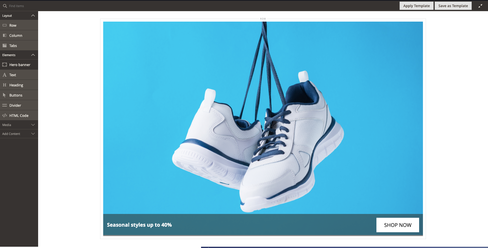
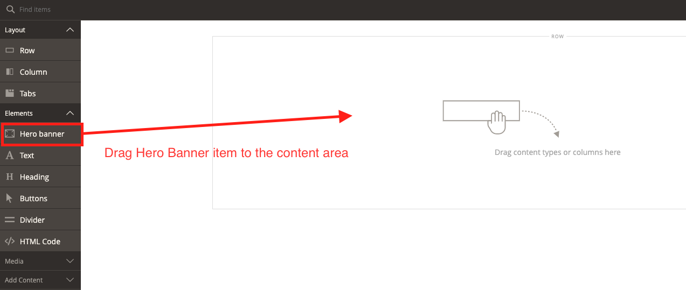
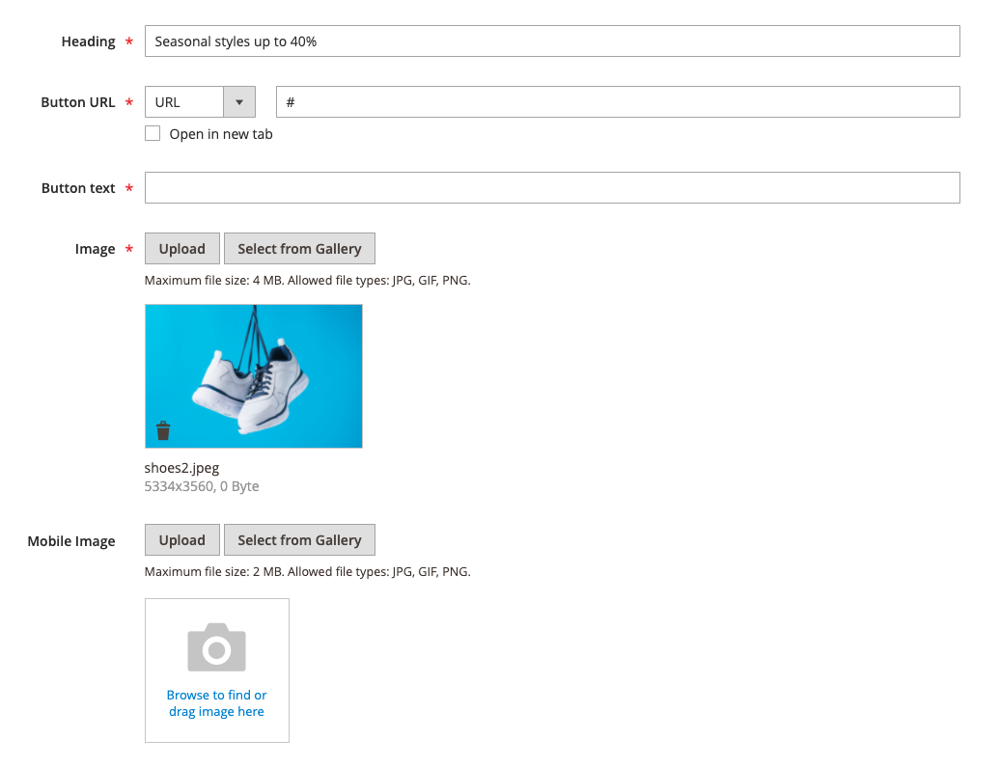

# Magento 2 Hero Banner extension [PWA Studio ready!]

Magento 2 extension that allows administrators to create Hero Banners.

## Frontend:

## Admin panel:

Administrators can inject Hero banners for any CMS Page or CMS block by 
creating the Hero Banner custom Page Builder componet.

## PWA Studio
This extension is ready for use with PWA Studio. If you want to add it to your headless store, visit
[PWA Studio Hero Banner extension repository page](https://github.com/Frodigo/hero-banner-ee-pwa)

## How to insert widget to CMS Page

1. Step 1: Open CMS Page/Block
1. Find Hero Banner component in Page builder items navigation
and drag the component to the content area 
1. Fill in all required fields 
1. Step 5: Save the CMS Page

## Installation

`composer require marcinkwiatkowski/hero-banner-pagebuilder`

## Magento platform compatibility
Commerce (EE): 2.3.x, 2.4.x

## Contribution

Feel free to Fork and contribute to this module and create a pull request so i will merge your changes to main branch.
If you have any questions/suggestions, please create an issue.
